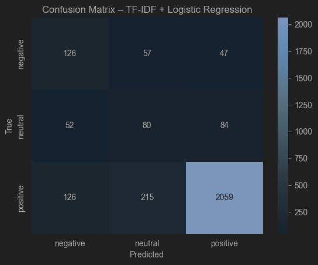
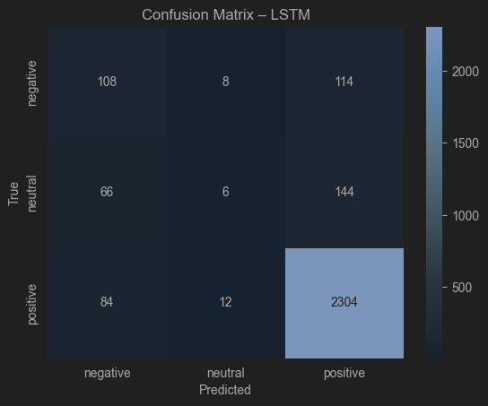
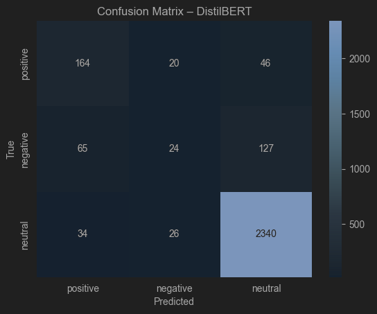

# **Projekt zaliczeniowy – Zastosowania Uczenia Maszynowego**

## **1. Informacje ogólne**
**Nazwa projektu:**  
*Analiza nastroju recenzji książek na podstawie opinii recenzentów*

**Autor:**  
Wojciech Siemiątkowski

**Kierunek, rok i tryb studiów:**  
Informatyka, studia magisterskie, rok 2 studia internetowe

**Data oddania projektu:**  
17.01.2025  

---

## **2. Opis projektu**
> Celem projektu jest klasyfikacji nastroju/emocji użytkownika na podstawie
treści recenzji książek. Projekt pozwoli na analizę nastroju użytkownika serwisu
amazon, co może być ciekawą odmianą od np. wykorzystania danych z
GoodReads, gdzie pojawiają się recenzje zarówno od osób które kupiły,
wypożyczyły lub odsłuchały dany tytuł. W przypadku amazona możemy założyć,
że osoba pisząca recenzje kupiła i przeczytała daną książkę w formie
papierowej.

---

## **3. Dane**
**Źródło danych:**  
HuggingFace

**Link do danych:**  
`https://huggingface.co/datasets/cogsci13/Amazon-Reviews-2023-Books-Review`  

**Opis danych:**  
- liczba próbek: użyto 15000, dostępne - 29.5 miliona   
- liczba cech / kolumn: 10
- format danych: najważniejsze kolumny to rating - float, text - string
- rodzaj etykiet / klas: początkowo float, przerobiony na sentyment   
- licencja: otwarta, udostępnione akademicko, niesprecyzowana    

**Uwagi:**  
- w sample znajduje się 100 przykładowych rekordów
- użyto 15k przykładów z ogromnego datasetu o pojemności 29.5M przykładów
- wylosowano 1.5M przykładów do ściągnięcia, z nich wybrano 15k
- nie było wartości brakujących, usunięto duplikaty
- dataset jest bardzo niezbilansowany, myślałem o sztucznej zmianie tego stanu rzeczy, jednak uznałem że wykracz to po za potrzeby kursu
- do danych dodano także informacje o obecności znaków takich jak wykrzyknik czy znak zapytania, mogłyby stanowić ciekawe poszerzenie tematu

---

## **4. Cel projektu**
Projekt wytworzył modele do klasyfikacji sentymentu recenzji książek, co mogłoby posłużyć do wyłapywania informacji o sentymencie innych recenzji zamieszczanych w internecie. Nie musiałyby one posiadać oceny książki, wystarczyłby sam tekst. Dzięki temu wydawca mógłby w sposób maszynowy zwiększyć dane o swoim tytule.

---

## **5. Struktura projektu**
Projekt składa się z czterech głównych etapów, każdy w osobnym notatniku `.ipynb`:

| Etap | Nazwa pliku | Opis                                                                                                          |
|------|--------------|---------------------------------------------------------------------------------------------------------------|
| 1 | `1_EDA.ipynb` | Analiza danych, wizualizacje, wnioski                                                                         |
| 2 | `2_Preprocessing_Features.ipynb` | Czyszczenie danych, preprocessing, inżynieria cech, brak tu tokenizacji, itp                                  |
| 3 | `3_Models_Training.ipynb` | Trening modeli klasycznego ML, sieci neuronowej i transformera, zawiera tokenizacje i inne potrzebne operacje |
| 4 | `4_Evaluation.ipynb` | Ewaluacja, porównanie modeli, wizualizacje wyników                                                            |

---

## **6. Modele**
Projekt obejmuje trzy różne podejścia do modelowania danych:

### **6.1 Model klasyczny ML**
- Algorytm: Regresja Logistyczna (Logistic Regression) z wektoryzacją TF-IDF (Term Frequency-Inverse Document Frequency).   
- Krótki opis działania: model łączy regresje logistyczną, która wyznacza liniową granicę między klasami z wektoryzacją, która przekształca tekst na reprezentację liczbową, nadając większą wagę słowom unikalnym dla danych dokumentów, a mniejszą słowom powszechnym
- Wyniki / metryki: Accuracy: 80%, macro F1-score: 0.55

### **6.2 Sieć neuronowa zbudowana od zera**
- Architektura: Rekurencyjna Sieć Neuronowa (RNN) z warstwą LSTM (Long Short-Term Memory) 
- Liczba warstw / neuronów: Warstwa wejściowa (Embedding): wektory o wymiarze 128 - Warstwa ukryta (LSTM): 128 jednostek pamięci - Warstwa wyjściowa (Dense): 3 neurony
- Funkcje aktywacji i optymalizator: wyjście softmax, funkcja straty sparse_categorical_crossentropy, optymalizator adam 
- Wyniki: Accuracy: 85%, macro F1-score: 0.47  

### **6.3 Model transformerowy (fine-tuning)**
- Nazwa modelu:  `distilbert-base-uncased`  
- Zastosowana biblioteka: HuggingFace Transformers
- Zakres dostosowania: fine-tuning, dołączono warstwę klasyfikującą  
- Wyniki: Accuracy: 89%, macro F1-score: 0.60   

---

## **7. Ewaluacja**
**Użyte metryki:**  
- precision    
- recall  
- f1-score
- macro avg f1-score 
- weighted avg f1-score
- confusion matrix

**Porównanie modeli:**

| Model | Metryka główna      | Wynik | Uwagi                                                                                                                                                                   |
|--------|---------------------|-------|-------------------------------------------------------------------------------------------------------------------------------------------------------------------------|
| Klasyczny ML | macro f1-score| 0.55  | najbardziej stabilny, po zwiększeniu ilości próbek jako jedyny zachował klasę neutral, zachodzi balans między precision a recall, brak głebokiego zrozumienia kontekstu |
| Sieć neuronowa | macro f1-score| 0.47  | najlepiej radzi sobie w wykrywaniu emocji skrajnych, kosztem klasy neutral (recall bliski 0)                                                                            |
| Transformer | macro f1-score| 0.60  | najlepiej rozumie kontekst, recall dla klasy negative na poziomie 71%, jedyny biznesowo użyteczny                                                                       |

**Wizualizacje:** znajdują się również w notebooku `4_Evaluation.ipynb`





**Stare metryki:** na początku użyłem tylko 5k przykładów, stąd w pliku old_metrics.txt można zobaczyć wpływ potrojenia
ich liczby na wyniki. Znacznie polepszyło to klasyfikacje negative, kosztem neutral. 

---

## **8. Wnioski i podsumowanie**
- zdecydowanie najlepiej poradził sobie bert
- projekt możnaby ulepszyć, gdyby dobrano konkretne ilości danych klas zamiast rozkładu wynikającego z samego datasetu,
podobnymi manipulacjami zajmuje się w pracy, tutaj jednak wydało mi się to przesadą
- modele możnaby wykorzystać do przeglądania mediów społecznościowych w celu znalezienia recenzji danej książki napisanej w języku naturalnym -
pozwoliłoby to na stworzenie datasetu recenzji z sentymentami bez udziału platform na których recenzje mogą być kupowane
- przewaga berta oznacza przewagę architektury transofmers, self-attention dało tutaj najgłębsze rozumienie tekstu pomimo trudnego datasetu
- wspomniane zwiększenie wzoru pozwoliłó LSTM na przejść z praktycznie losowych wyników, w przypadku klas mniejszościowych, do lepszych rezultatów
- bert wykazał się najlepszą czułością (recall)

---

## **9. Struktura repozytorium**
```
projekt_zum_2025/
│
├── data/
│ ├── raw/
│ ├── sample/
│ └── processed/
│       └── splits/
├── matrix/
├── notebooks/
│ ├── 1_EDA.ipynb
│ ├── 2_Preprocessing_Features.ipynb
│ ├── 3_Models_Training.ipynb
│ └── 4_Evaluation.ipynb
├── models/
│ ├── bert/ (za duży do wgrania do rep)
| ├── lstm/
│ └── ml/
├── results/
├── README.md
├── old_metrics.txt
└── requirements.txt
```
## **10. Technologia i biblioteki**
- Python 3.10  
- NumPy, Pandas, Matplotlib, Plotly, Seaborn  
- scikit-learn  
- TensorFlow lub PyTorch  
- HuggingFace Transformers  

---

## **11. Licencja projektu**
Projekt udostępniony na licencji: MIT
